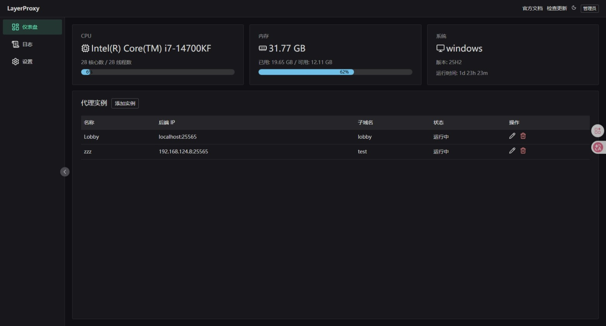

# Layer-Proxy

<p align="center">
  
  
  
  
</p>

**Layer-Proxy** 是一个专为 Minecraft 服务器设计的轻量级、高性能流量分发网关。它允许服主通过**域名路由**技术，在单一端口上复用多个独立的 Minecraft 后端实例，并提供了一套极简的 Web 管理界面。


## ✨ 核心特性

* **🌐 域名转发**：支持解析 Minecraft 握手包（Handshake），根据玩家连接的子域名（如 `survival.example.com`）自动分发流量。
* **📊 实时监控**：内置仪表盘，直观查看 CPU 占用、内存消耗及系统负载。
* **🎮 实例状态检测**：实时检测后端 Minecraft 服务器的连通性（Ping），确保服务可用性。
* **🛠️ 零配置上手**：引导式初始化流程，支持在 Web 端直接进行实例的 CRUD 操作。
* **🔒 安全可靠**：内置强密码校验逻辑，采用密钥访问控制，保障管理后台安全。
* **🚀 极速部署**：Go 语言编写，单二进制文件运行，内置 SQLite 数据库，无需安装额外环境。

## 🛠️ 技术栈

* **Backend**: [Go](https://go.dev/) + [Gin](https://gin-gonic.com/) + [SQLite](https://www.sqlite.org/)
* **Frontend**: [Vue 3](https://vuejs.org/) + [TypeScript](https://www.typescriptlang.org/) + [Naive UI](https://www.naiveui.com/)
* **Icons**: [Lucide Vue Next](https://lucide.dev/)

## 🚀 快速开始

### 1. 下载运行
从 [Releases](https://github.com/your-username/LayerProxy/releases) 页面下载对应系统的二进制文件。

```bash
# 解压并运行
./LayerProxy
```

### 2. 初始化
1.  程序启动后，默认 Web 端口为 `23754`。
2.  在浏览器访问 `http://localhost:23754`。
3.  按照引导界面设置你的**管理密钥**及**基础端口配置**。

### 3. 添加实例
在“实例管理”页面添加你的后端服务器信息：
* **名称**：服务器标识（如：小游戏服）
* **后端 IP**：后端真实的 IP 和端口（如：`127.0.0.1:25565`）
* **子域名**：匹配的域名前缀（如：`play`）

## 📸 预览



## 📄 开源协议

本项目采用 [Mozilla Public License 2.0](http://mozilla.org/MPL/2.0/) 协议开源。

## 🤝 贡献

欢迎提交 Issue 或 Pull Request 来完善 Layer-Proxy！